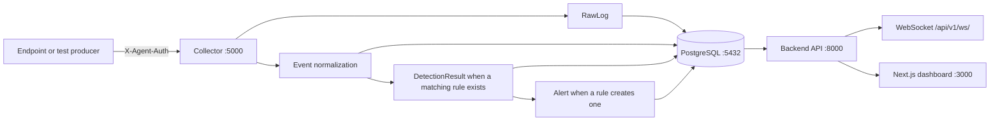

# SOC Monitor Documentation

SOC Monitor is a local-host FastAPI, PostgreSQL, collector, and Next.js monitoring platform. This repository contains the backend API, collector ingestion pipeline, database migrations, dashboard, detection, investigation, reporting, and security controls. Windows and Linux endpoint agents live in the separate [Security-Monitering-Agent repository](https://github.com/vishal-s-se/Security-Monitering-Agent) and send telemetry only to this repository's collector.

## Architecture

The collector is the endpoint-facing boundary. Agents must never connect directly to PostgreSQL. `RawLog` preserves the submitted payload; `Event` stores normalized fields. Detection and alert creation depend on configured detection rules and are not implied by ingestion alone.

## Components

- **Database:** PostgreSQL, SQLAlchemy async sessions, and Alembic migrations.
- **Collector:** FastAPI service on port `5000`; authenticated registration, heartbeat, and event ingestion.
- **Backend:** FastAPI service on port `8000`; authenticated API, investigations, reports, retention, analytics, and WebSocket endpoint.
- **Dashboard:** Next.js App Router application on port `3000`.
- **Agents:** Not implemented in this repository. Windows and Linux collection must be supplied by an external producer or a future agent package.

## Implemented API areas

Authentication, events, raw logs, alerts, investigations, hosts, agents, detection rules/results, MITRE mappings, analytics, reports, retention, health, and WebSocket transport are registered under `/api/v1`. See [API Reference](api.md).

## Security boundary

Implemented controls include password hashing, expiring JWTs with in-process revocation, role checks, request-size limits, rate limiting, explicit CORS, security headers, collector shared-secret authentication, input validation, safe report filenames, and audit logging. TLS termination and certificate management are deployment responsibilities; CSRF protection is not separately required for the bearer-token API.

## Documentation map

- [Installation and deployment](deployment.md)
- [API Reference](api.md)
- [Security controls](security.md)
- [Detection and alerts](detection.md)
- [Authorized SOC lab guide](soc-lab.md)
- [Release and implementation checklist](release-checklist.md)
- [Database architecture](architecture/database.md)
- [Database development](development/database.md)

## Endpoint agents

The authoritative [Security-Monitering-Agent repository](https://github.com/vishal-s-se/Security-Monitering-Agent) contains the shared core, Windows agent, Linux agent, configuration, buffering, platform collectors, and agent tests. This repository owns the collector contract and downstream SOC processing.

## Important limitation

Telemetry claims must match the producer. Agent availability and platform permissions determine which sources reach the collector. An event indicator is not proof of compromise.
