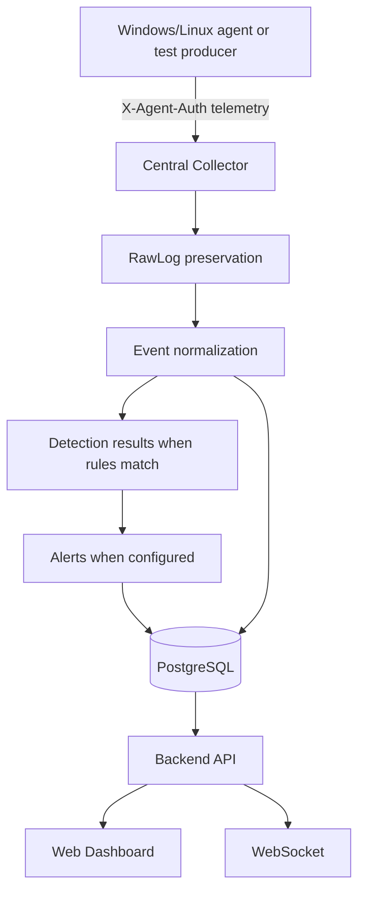

# Architecture Overview

The SOC Monitor platform follows a distributed, event-driven architecture designed to decouple collection from analysis and display.

## High-Level Data Flow

## Architectural Boundaries

1. **Collector vs Backend:** The collector is the endpoint-facing ingestion service. The backend serves the dashboard and analyst API.
2. **Agents vs Database:** Agents must never communicate directly with PostgreSQL. All producer traffic goes through authenticated collector routes.
3. **Frontend vs Backend:** The Next.js frontend retrieves data through the backend API and subscribes to the backend WebSocket endpoint.
4. **Raw vs normalized data:** `RawLog` preserves the received payload; `Event` contains normalized, queryable fields.

## Current Implementation Status

The backend, collector, database migrations, dashboard, detection result model, alert/investigation/MITRE surfaces, retention controls, authenticated WebSocket server, and lightweight Windows/Linux agents are implemented. Agent telemetry remains dependent on readable platform sources; the repository does not include a default enabled detection catalog or a Redis-backed queue.

See the [release checklist](../release-checklist.md) for the authoritative implementation status.
