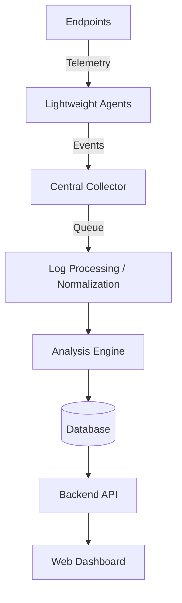

# Architecture Overview

The SOC Monitor platform follows a distributed, event-driven architecture designed to decouple collection from analysis and display.

## High-Level Data Flow

## Architectural Boundaries

1.  **Collector vs Backend**: The Central Collector acts as an ingestion pipeline for agent events. It operates independently of the Backend API, allowing it to scale based on agent traffic without impacting the web dashboard's performance.
2.  **Agents vs Database**: Agents never communicate directly with the database. All interactions are routed through the Collector to ensure security and data normalization.
3.  **Frontend vs Backend**: The Next.js frontend is decoupled from the backend and collector. It retrieves data strictly through the Backend API layer.

## Current Implementation Status

**IMPLEMENTED NOW (Phase 1):**
- Foundation for API, UI, and Collector.
- Docker Compose orchestration.
- Basic routing and health endpoints.
- Project structure and boundaries.

**PLANNED FOR FUTURE PHASES:**
- Complete agent implementation (Windows/Linux).
- Database schema mapping and migrations.
- Redis event queue processing.
- Detection engine (MITRE ATT&CK rules).
- Alert generation and WebSockets.
